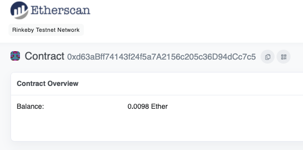

Table of contents

- [Why web3?](#why-web3)
- [Few articles I started with](#few-articles-i-started-with)
- [First steps](#first-steps)
- [First project](#first-project)
  - [Notes](#notes)
    - [Mining](#mining)
    - [Deploy contract](#deploy-contract)
    - [Gas limit](#gas-limit)
    - [Funding contract](#funding-contract)
    - [Random number problem](#random-number-problem)
- [Tools](#tools)
  - [Final website](#final-website)
- [What's next?](#whats-next)

# Why web3?

Like a lot of people I got interested in crypto after it already became famous, especially famous around Bitcoin prices. Around 2 years ago I started to read about it, invested some spare cash, make some small profit and dig deeper into the topic for a while.

After that time I got more and more involved in following technical discussions and developers (mostly JavaScript/TypeScript) on Twitter. In the last months the discussion about decentralized internet was really taking over my twitter bubble dashboard, mostly thanks to Nader Dabit which I was following before he went full on web3.

The concept of decentralized internet, alternative to big tech companies(Amazon, Google, Microsoft) oligopoly seemed very interesting. Then I started to read about Decentralized Finance (DeFi), smart contracts, NFTs - it all seem to be ideas that has real potential to change the internet as we know today.

I like to learn about the subject on the real examples, by getting my hands dirty and making mistakes. So I decided to dedicate some of my free time to learn more about it.

# Few articles I started with

- [How to Get Into Ethereum | Crypto | Web3 as a Developer by Nader Dabit](https://dabit3.medium.com/how-to-get-into-ethereum-crypto-web3-as-a-developer-4723d8ddaa6b)
- [I created a Web3 app and here's what I learned, by Camila Ramos](https://camiinthisthang.hashnode.dev/wthisweb3)
- [Complete Web3.0 And Solidity Development Roadmap 2021, by Vittorio Rivabella](https://vitto.cc/web3-and-solidity-smart-contracts-development-roadmap/)

Of course there were more, I got suck by the rabbit hole of web3 discussions, threads and articles on twitter. Did not note all which I read but these 3 I can remember.

# First steps

- [Ethereum docs](https://ethereum.org/en/developers/docs/) - These i started to read immediately after I decided to learn more about web3. Its a great resource and frankly I was surprised its written so well. You will learn there about accounts, blocks, mining, minting, smart contracts, gas and more. Highly recommend it.

Joined some great Discord channels - its easier to help each other and learn from others mistakes, few i can recommend:

- [BlockchainJS, created by Cat McGee](https://twitter.com/CatMcGeeCode/status/1448282741288710155) - community created for JS developers that wants to learn more about web3
- [Buildspace](https://buildspace.so/) - the text from their website says it all: "If you're a dev that's curious about web3 but not sure where to start -- this is the spot for you. Learn + start building cool stuff right now, earn NFTs, access secret work opportunities in crypto.".
- [Developer DAO](https://twitter.com/developer_dao) - You have to mint a free token to join the community but its worth it. One of the creators is mentioned earlier Nader Dabit.

# First project

On BlockchainJS there was a discussion on how to start learning about web3 and which tutorial to watch. We all decided that buildspace is the best resource and started build our first app, sharing experience on the server.

The app is **Wave Portal:**

- Use basic Solidity to develop smart contract
- Run and test contract locally
- Write and deploy smart contract on blockchain to track what user waved at us, from which wallet address.
- Deploy contract to Ethereum Rinkeby network - which is a test network where we use fake eth
- Connect wallet to the app
- Randomly rewarding useres that waved at us with fake rinkeby eth
- Build frontend in React and connect it with deployed contract
- Let users submit a message along with their wave. Have that data saved on the blockchain. Show that data on our site so anyone can come to see all the people who have waved at us and their messages.

## Notes

- **Transaction** - its any action we want to perform on Ethereum blockchain. For example: deploy smart contract, send someone ETH, in our app it is adding waves from application
- **[Etherscan](https://etherscan.io/)** is **a tool to help you view data regarding any pending or confirmed Ethereum blockchain transactions**. Since Ethereum is a public, open blockchain, whenever anyone interacts with it the action is recorded into the transaction history and it is open for anyone to see.

### Mining

Any transaction on blockchain needs to be mined by miners. It means they are picking it up, perform calculations to add them to the block using computer power and claim reward for it. Once the transaction is mined, it is then broadcasted to the blockchain as a legit transaction. From there, everyone updates their copy of the blockchain.

The WavePortal is build on Ethereum Rinkeby test network so I did not have to use real ETH value. Testnets are run by actual miners and mimic real-world scenarios. So this is how the full transaction is being added to blockchain:

1. Broadcast the transaction (wave with message was done by the specific users wallet address)

2. Wait for it to be picked up by actual miners

3. Wait for it to be mined

4. Wait for it to be broadcasted back to the blockchain telling all the other miners to update their copies

But how to test it locally to see if waving works? I would have to have ETH to pay for **[transactions gas](https://ethereum.org/en/developers/docs/gas/)** - in real world I would use real ETH**.**
In order to add fake ETH to my wallet address I needed to claim fake ETH from something which is called **faucet.** There were few recommended by the buildspace team.

### Deploy contract

- To **deploy** a contract we need to login to network to authanticate as a user - thats where we need wallet public and private key.
- After deploy, I was receiving contract address - I could look it up on [https://etherscan.io/](https://etherscan.io/) . In my case it was [https://rinkeby.etherscan.io/](https://rinkeby.etherscan.io/) - etherscan for Rinkeby test network.
- When I was building the smart contract and some basic version was already deployed to the blockchain - every time i wanted to make a change i had to **redeploy** the whole contract. Basically it was brand new, not the updated version of an old one.
  Why? Because smart contract are **immutable,** they \*\*\*\*cant change.
  So if I waved few times on a previous version of contract I would have to forget about it - i wont be using it anymore. After redeploy i would link my app with shiny fresh contract.

### Gas limit

The next part of the building app was to send eth (from test network) to the person who waved at my portal randomly. The problem is: if the contract sends a prize then the waver need to pay **more gas** since we're running **more code**

- Estimating gas is a hard problem and an easy workaround for this is to set a limit.
- on client side I added `wavePortalContract.wave(message, { gasLimit: 300000 })` to make the user pay a set amount of gas of 300,000. And, if they don't use all of it in the transaction they'll automatically be refunded.
- So, if a transaction costs 250,000 gas then **after** that transaction is finalized that 50,000 gas left over that the user didn't use will be refunded

### Funding contract

Why? T**o send ETH to someone, our contract needs to have ETH on it.** We are not sending the eth directly from our account. The contract itself has its own balance, provided by us :)

How this works is when we first deploy the contract, we "fund" it.

Setting constructor properly makes contract payable:

```jsx
constructor() payable {
  console.log("We have been constructed!");
}
```

After we deployed funded contract - we can check it out on Etherscan to see the balance. In my case it looks like in below screen - i funded m contract with 0.01 fake ETH. Its missing 0.0002 eth because it was randomly given to some of the "wavers" on my app.



On [Rinkeby Etherscan](https://rinkeby.etherscan.io/) you can also validate the contract itself and view the transactions that have taken place.

### Random number problem

Not mine, direct quote from buildspace. it is quite interesting:

- Normally when you generate a random normally in a program, **it will take a bunch of different numbers from your computer as a source of randomness** like: the speed of the fans, the temperature of the CPU, the number of times you've pressed "L" at 3:52PM since you've bought the computer, your internet speed, and tons of other #s that are difficult for you to control. It takes **all** these numbers that are "random" and puts them together into an algorithm that generates a number that it feels is the best attempt at a truly "random" number
- On the blockchain, there is **nearly no source of randomness**. Everything the contract sees, the public sees. Because of that, someone could game the system by just looking at the smart contract, seeing what numbers it relies on for randomness, and then the person could give it the exact numbers they need to win.

# Tools

- Ethereum development environment. Build local blockchain server and deploy contracts
  [https://hardhat.org/](https://hardhat.org/)
- Client side done with React js
- Metamask - ETH wallet
- Alchemy - [https://www.alchemy.com/](https://www.alchemy.com/) - blockchain layer - instead setting up AWS , Google Cloud or MS Azure.
  Alchemy helps us broadcast our contract creation transaction so that it can be picked up by miners as quickly as possible
- Etherscan is a place that just shows us the state of the blockchain and helps us see where our transaction is at.
  The etherscan for rinkeby testnet: [https://rinkeby.etherscan.io/](https://rinkeby.etherscan.io/)
- Faucets

## Final website

- [Project website](https://b-jakubowski.github.io/waveportal-starter-project/)
- You have to have installed and set up [Metamask](https://metamask.io/) in your browser to play with it

# What's next?

- Crypto zombies
- Web3 app to show my NFT collection built with Solidity
- Learn more about solidity
